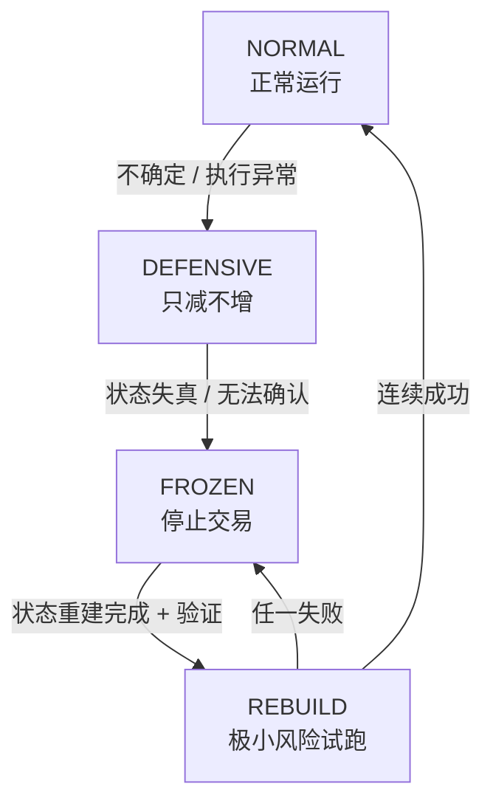

# 现金流治理系统核心总结（顶级量化机构级）
本内容从**敌人视角击穿风险**出发，反向构建了一套不可绕过、可落地的量化交易现金流治理体系，核心脱离“策略盈利”思维，聚焦**现金流主权与系统生存**，完成从“策略设计”到“资金治理”的顶级跨越，以下是无遗漏核心要点：

## 一、核心前提：敌人视角的7大击穿场景（风险根源）
所有风险均不针对策略参数/逻辑，而是攻击**现金流系统的现实脆弱连接点**，最终让**现金流治理机制失效**，按危险程度排序核心致命点为：
1. 成交/状态不一致（幻觉仓位/对冲，最致命）；
2. 极端市场下策略引擎相关性翻转（对冲失效、风险叠加）；
3. 系统被状态噪声拖慢反应（结构性磨损、现金流不可逆下滑）；
4. 执行层不可信时仍允许新增风险（人性冲动下的致命下注）；
5. 制度级异常暴露现金流（交易所规则/API变动，治理逻辑失效）；
6. 对流动性过度乐观（对冲时无深度、滑点放大亏损）；
7. 过度信任逻辑正确性（慢性死亡，整体期望转负却坚持）。
**最易击穿的3个核心**：成交/状态不一致、极端regime下引擎相关性翻转、冻结条件不够硬。

## 二、底层准则：现金流系统宪法（7条硬约束，不可绕过）
所有系统行为均以此为根本遵循，是策略无法突破的“宪法级”规则，目标是**在任何混乱/错误/不确定的现实中，现金流不被击穿**：
1. **成交事实高于一切逻辑**：仅已确认的成交/资金变化可驱动现金流状态，否则系统进入不确定态、仅允许平仓；
2. **不确定性优先于收益**：核心状态不确定时默认最大风险，自动冻结新风险、进入防守模式；
3. **冻结权不可被任何策略覆盖**：冻结触发后无例外，仅状态完全重建确认可解除；
4. **任何策略都必须可被冷酷关闭**：策略无生存权，中央银行拥有降级/封存/退役权，无申诉机制；
5. **极端状态下相关性假设为1**：极端波动/交易所异常时，所有引擎风险预算合并，放弃对冲幻觉；
6. **现金流宁可停摆，也不能失控**：无法确认真实敞口/执行平仓时，直接停止交易、等待重建；
7. **系统必须允许“什么都不做”**：“不交易”是合法可持续状态，拒绝环境错误下的硬扛。

## 三、系统核心：四态现金流状态机（机构级心脏，状态不可逆流转）
系统仅存在4种状态，各状态有**硬行为定义**，流转触发条件明确，99%系统缺失的**REBUILD态**是避免反复死亡的关键，默认状态为NORMAL，流转逻辑为：**NORMAL→DEFENSIVE→FROZEN→REBUILD→NORMAL**
1. 🟢**NORMAL（正常运行）**：策略可申请风险，中央银行审批，正常现金流运转；
2. 🟡**DEFENSIVE（防守模式）**：触发于不确定/执行异常，禁止新增风险、仅允许减仓平仓，所有引擎相关性=1；
3. 🔴**FROZEN（冻结状态）**：触发于严重异常/状态失真，禁止所有交易，仅接受**事实重建**，拒绝“再试一次”；
4. 🔵**REBUILD（重建试跑）**：触发于状态重建完成，极小仓位验证执行/成交/状态一致性，连续成功解冻回NORMAL，任一失败直接退回FROZEN。

## 四、落地映射：宪法与系统核心的工程化对应
基于现有量化系统模块，将宪法与状态机落地到具体模块，明确**约束规则、新增字段、核心行为**，核心原则为**AccountState是唯一事实账本**，所有信息流不可绕过：
1. 成交事实/不确定性：映射TinyOMS、AccountState、DataSynchronizer，AccountState新增`state_confidence（0~1）`字段，仅OMS的已确认fill可驱动其变更；
2. 冻结/策略关闭：映射RiskManager（中央银行）、MainController，新增`StrategyRegistry`管理策略启停状态，冻结后直接拒绝所有策略Intent；
3. 极端相关性/停摆规则：映射RiskManager，极端状态下执行**所有敞口合并计算**，失控时直接置为FROZEN态；
4. 合法空交易：全系统遵循，主循环允许空跑，无信号/无交易≠系统失败。

## 五、主权核心：中央银行（现金流治理唯一决策者）
**中央银行不参与任何策略判断**，仅掌握现金流主权，是连接AccountState与系统状态机的核心，唯一权限为5项，策略无否决/申诉权：
1. 判断现金流状态是否可信；
2. 判断是否允许现金流暴露；
3. 分配/回收全系统风险预算；
4. 冻结/解冻系统整体状态；
5. 冷酷关闭任一策略引擎。

## 六、策略定位：现金流插件（无生存权，仅拥有使用权）
策略的核心价值是“赚钱”，但并非系统核心，仅为可插拔组件，严格遵循3条规则：
1. 仅可提交交易Intent，无修改系统状态的权限；
2. 无法绕过系统冻结/防守规则，信号在非NORMAL态下无效；
3. 可被中央银行永久关闭，无任何申诉/否决机制。

## 七、关键触发规则：立即冻结+系统死亡标准
### （1）3条立即冻结红线（任意触发→直接进入FROZEN）
1. 成交/仓位/资金状态无法一致解释；
2. 执行层（OMS/交易所）行为超出系统模型假设；
3. 需“相信”系统而非“确认”系统（主观判断也为硬触发）。

### （2）3条系统死亡标准（任意触发→永久关机，无恢复可能）
1. 真实敞口无法确认（合理时间内无法重建仓位、无法解释权益变化）；
2. 现金流宪法被绕过（策略突破冻结、非成交事件修改状态、人工干预破坏规则）；
3. 管理者不再信任系统（需要“赌系统没问题”，而非“确认系统没问题”）。
**核心原则**：赚钱≠系统活着，生存优先于一切收益。

## 八、系统运行底层逻辑（1页运行图核心）
### （1）唯一合法信息流（无任何绕过可能）
Market/Exchange Reality → Execution Layer（OMS/Fills/Positions）→ AccountState（唯一事实账本）→ Central Bank（现金流主权）→ System Mode（状态机）→ Strategy Permission（策略下注权限）
### （2）一句话核心宗旨
策略是来赚钱的，系统是来阻止愚蠢的；**系统的唯一目标不是盈利，而是让现金流在任何现实下不中断、不失控、不被幻觉驱动**。

## 九、最终结论与执行要求
1. 本体系已达到**顶级量化机构核心治理水平**，完成从“顶尖设计者”到“资金主权者”的最后跨越，核心竞争力并非策略聪明度，而是现金流治理的硬约束；
2. 执行核心：**放弃“看起来能赚钱”的人性冲动，在需要冻结/关机时果断执行**，这是顶级量化机构最稀缺的能力；
3. 落地关键：无需再优化策略逻辑，而是按本体系**逐条落地硬约束、熬现实验证**，让系统完全遵循“生存优先”原则。


---------------------------------------


# 📄 现金流系统运行图（One-Page）
**视角**：现金流主权 / 系统治理 / 现实执行

---

## 1️⃣ 系统唯一目标（核心准则）
目标不是赚钱，而是：
在任何现实条件下，现金流不中断、不失控、不被幻觉驱动。

---

## 2️⃣ 合法信息流（唯一可信链路）
```
Market / Exchange Reality
        ↓
   Execution Layer
 (OMS / Fills / Positions)
        ↓
   AccountState
 (唯一事实账本)
        ↓
 Central Bank
 (现金流主权)
        ↓
 System Mode
 (状态机)
        ↓
 Strategy Permission
 (是否允许下注)
```
🚫 任何绕过 AccountState 的信息 = 非法信息

---

## 3️⃣ 四态现金流状态机（系统心脏）


---

## 4️⃣ 各状态硬行为定义（不可协商）
| 状态       | 标识 | 核心行为                                                                 |
|------------|------|--------------------------------------------------------------------------|
| NORMAL     | 🟢   | 可申请新风险<br/>中央银行审批<br/>策略正常运行                           |
| DEFENSIVE  | 🟡   | ❌ 禁止新增风险<br/>✅ 允许减仓/平仓<br/>所有引擎相关性假设 = 1          |
| FROZEN     | 🔴   | ❌ 所有交易禁止<br/>❌ 策略信号全部无效<br/>等待事实重建（非感觉恢复）|
| REBUILD    | 🔵   | 极小仓位运行<br/>验证执行/成交/状态一致性<br/>连续成功→解冻，任一失败→FROZEN |

---

## 5️⃣ 中央银行（现金流主权）唯一权限清单
中央银行不做策略判断，仅执行以下5项核心动作：
1. 判断状态是否可信
2. 判断是否允许现金流暴露
3. 分配 / 回收风险预算
4. 冻结 / 解冻系统
5. 冷酷关闭任一策略

> 策略无否决权、无申诉权

---

## 6️⃣ 策略的真实地位
策略 = 现金流插件（非系统核心，无生存权，仅有使用权）：
- 策略只能提交 Intent
- 策略不能修改状态
- 策略不能绕过冻结
- 策略可被永久关闭

---

## 7️⃣ 立即冻结的三条红线（触发即FROZEN）
1. 成交 / 仓位 / 资金 无法一致解释
2. 执行层行为 超出模型假设
3. 需“相信”系统而非“确认”系统

---

## 8️⃣ 系统死亡标准（必须永久关闭）
满足任一条件即判定系统“死亡”：
- 无法确认真实敞口
- 现金流宪法被绕过
- 你不再信任它

> 赚钱 ≠ 活着

---

## 9️⃣ 一句话核心记忆点
策略是来赚钱的，
系统是来阻止愚蠢的。